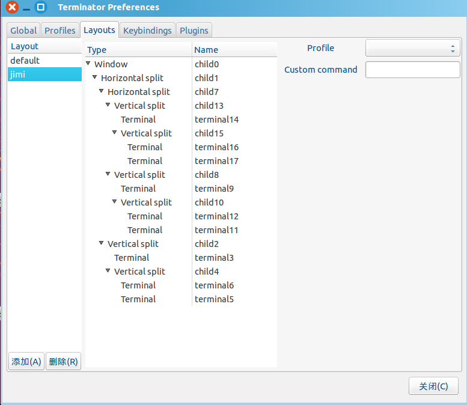

# Terminator使用
Terminator 可以在同一个窗口上分割多个子窗口，每个小窗口运行独立的命令程序。
一个父窗口管理多个子窗口，清晰明了知道每个子窗口的运行情况。可以快速自由切换子窗口，
并且对子窗口进行最大化和全屏状态。除此之外还有自定义窗口标题、激活标签等等。

## 一、安装
在命令窗口输入以下安装命令：

```bash
sudo add-apt-repository ppa:gnome-terminator
sudoapt-get update
sudo apt-get install terminator
```

如果你要移除Terminator，卸载命令:

```bash
sudo apt-get remove terminator
```

安装完成后按 ctrl+alt+t，就会运行Terminator窗口

## 二、配置
### 选项卡
    步骤：右键->首选项
    如图：
    
首选项有5个tab页，分别是 Ｇlobal 、Profiles、Layouts、KeyBindings、Plugins

- Global: 这个全局设置参数，多个profiles 公用的参数，可以理解为主体窗口的配置。比如光标的大小、分离窗口的大小、子窗口失去焦点的蒙层效果，标题bar的设置包括 标题的颜色、大小、标题栏的背景颜色等等。
- Profiles: 配置个性主题的。在里面添加多个profiles,可以切换主题使用，减少审美疲劳。主要配置有，设置字体的大小、颜色、样式，光标颜色、形状等等。
- Layouts: layout子窗口的配置。可以添加多个layout，子窗口可以多个proflies文件。
- Keybindings: 终端的常用快捷键。可以自定义设置自己的快捷键。比如 打开关闭窗口、跳转、分割、复制粘贴等等。稍后会讲解常用的快捷键的使用。
- Plugins: Terminator 的插件. 有 ActivityWatcher、Logger 等等 根据需求，安装对应的插件。

**Tip：在terminator里定义好自己的布局，直接在Layouts tab页添加，即可。然后就会存入terminator配置文件。**

### Terminator的默认配置文件
命令如下：
    
```bash
 vim ~/.config/terminator/config
```

## 三、启动
命令：

```bash
terminator -l jimi_layout -m
```

## 四、快捷键

```
Ctrl+Shift+O        水平分割终端
Ctrl+Shift+E        垂直分割终端
Ctrl+Shift+F        搜索
Ctrl+Shift+C        复制
Ctrl+Shift+V        粘贴
Ctrl+Shift+W        关闭当前终端
Ctrl+Shift+Q        退出当前窗口
Ctrl+Shift+T        打开终端
Ctrl+Shift+X        切换显示当前窗口
F11                 全屏状态
Ctrl+Shift+G        清屏幕
Ctrl+Shift+Right    在垂直分割的终端中将分割条向右移动
Ctrl+Shift+Left     在垂直分割的终端中将分割条向左移动
Ctrl+Shift+S        隐藏/显示滚动条

Ctrl+Shift+T        打开一个新的标签
Ctrl+PageDown       移动到下一个标签
Ctrl+PageUp         移动到上一个标签
```
